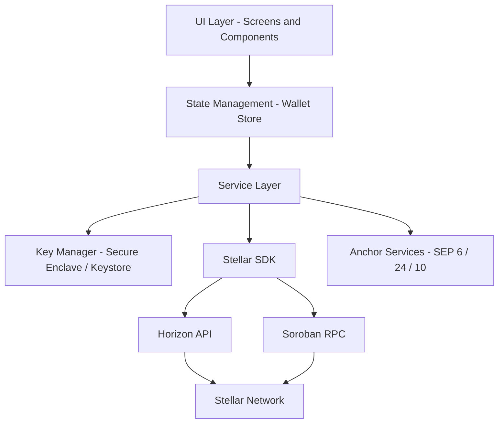
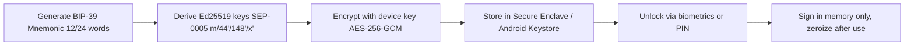
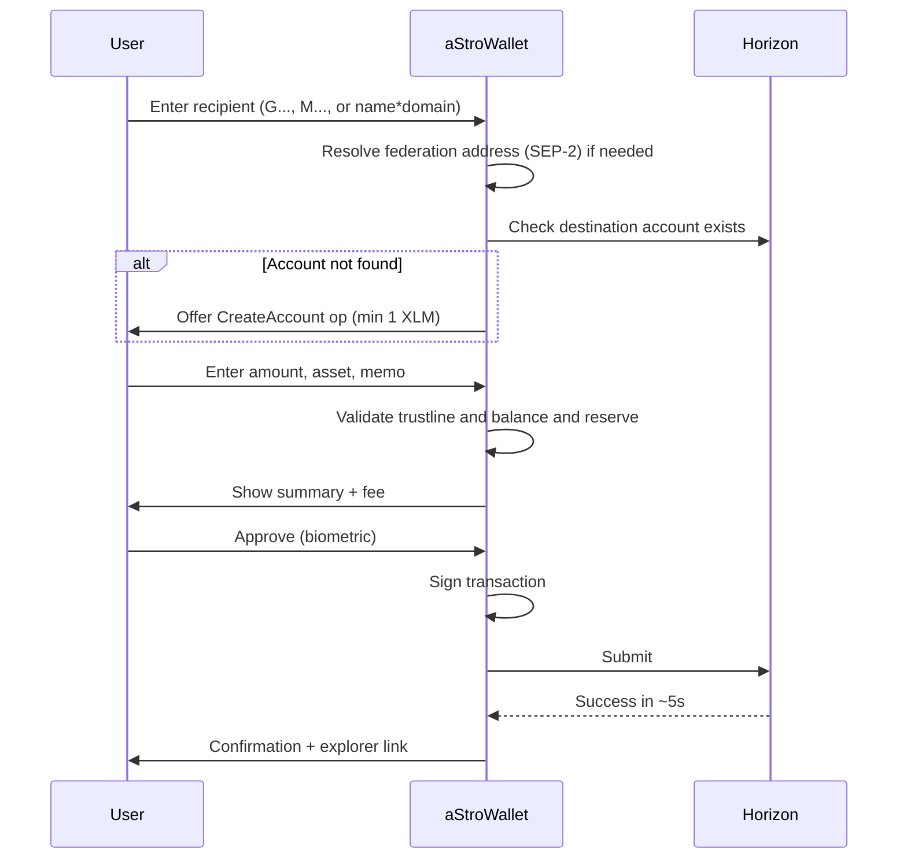

# aStroWallet — Design Document

> A fast, secure, non-custodial wallet built on the **Stellar** network ([stellar.org](https://stellar.org/))

---

## 1. Overview

**aStroWallet** is a non-custodial crypto wallet for the Stellar blockchain. It lets users create and manage Stellar accounts, hold XLM and other Stellar assets, send borderless payments, swap assets via the built-in DEX, and interact with **Soroban** smart contracts.

### Why Stellar?

| Metric | Value |
|---|---|
| Settlement time | ~5 seconds (avg. 9.5s incl. confirmation) |
| Average transaction cost | ~$0.0007 (100 stroops base fee) |
| Consensus | Stellar Consensus Protocol (SCP) — energy-efficient, no mining |
| Global reach | 100+ countries with cash-to-crypto ramps (anchors) |
| Smart contracts | Soroban (Rust/WASM) |

Stellar is purpose-built for payments, asset tokenization, and real-world financial access — a perfect base layer for a consumer wallet.

---

## 2. Goals & Non-Goals

### Goals
- ✅ Non-custodial: keys never leave the device
- ✅ Create / import / restore accounts (BIP-39 mnemonic, SEP-0005 derivation)
- ✅ Send & receive XLM and custom Stellar assets
- ✅ Manage trustlines (add/remove assets)
- ✅ Path payments & asset swaps via Stellar DEX
- ✅ Fiat on/off-ramps through Stellar anchors (SEP-24 / SEP-6)
- ✅ Soroban smart contract interaction (sign & submit invocations)
- ✅ Federation / address resolution (SEP-2, `name*domain.com`)
- ✅ Testnet + Mainnet (Pubnet) support

### Non-Goals (v1)
- ❌ Custodial key management / cloud key storage
- ❌ Multi-chain support (Stellar only)
- ❌ Built-in staking (Stellar has no staking)
- ❌ NFT marketplace (view-only support may come later)

---

## 3. Stellar Concepts Used

| Concept | How aStroWallet uses it |
|---|---|
| **Accounts** | Ed25519 keypair, `G...` public address, `S...` secret seed |
| **Base reserve** | 1 XLM minimum balance + 0.5 XLM per entry (trustline, offer, signer) — wallet must surface "available vs. locked" balance |
| **Trustlines** | Required before holding any non-XLM asset; managed via `ChangeTrust` op |
| **Assets** | `code:issuer` pairs (e.g. `USDC:GA5ZSE...`) |
| **Payments** | `Payment`, `PathPaymentStrictSend`, `PathPaymentStrictReceive` |
| **DEX** | Order books + AMM liquidity pools for swaps |
| **Memos** | Text/ID memos — critical for exchange deposits, must warn users |
| **Sequence numbers** | Transaction ordering per account |
| **Fees** | Fee-bump transactions & surge pricing awareness |
| **Muxed accounts** | `M...` addresses (SEP-23) for sub-account routing |
| **Soroban** | Smart contract invocation, simulation before signing |
| **Anchors** | SEP-6/24 deposits & withdrawals, SEP-10 web auth, SEP-12 KYC |

---

## 4. Architecture



### 4.1 Layers

1. **UI Layer** — screens, navigation, theming (dark/light).
2. **State Management** — single wallet store: accounts, balances, tx history, network selection, price feeds.
3. **Service Layer**
   - `AccountService` — create, import, fund (friendbot on testnet), account details
   - `TransactionService` — build, simulate, sign, submit, track
   - `AssetService` — trustlines, asset metadata (`stellar.toml` / SEP-1)
   - `SwapService` — strict-send/receive path finding, AMM quotes
   - `AnchorService` — SEP-10 auth, SEP-24 interactive deposits/withdrawals
   - `SorobanService` — contract simulation, footprint/fee estimation, invocation
4. **Key Manager** — mnemonic generation (BIP-39), SEP-0005 key derivation (`m/44'/148'/x'`), encrypted storage, biometric unlock.
5. **Stellar SDK** — official SDK (`@stellar/stellar-sdk` for JS or `stellar_flutter_sdk` etc. depending on platform).

### 4.2 Network Endpoints

| Network | Horizon | Soroban RPC | Passphrase |
|---|---|---|---|
| Mainnet | `https://horizon.stellar.org` | `https://soroban-rpc.mainnet.stellar.gateway.fm` (or provider) | `Public Global Stellar Network ; September 2015` |
| Testnet | `https://horizon-testnet.stellar.org` | `https://soroban-testnet.stellar.org` | `Test SDF Network ; September 2015` |

---

## 5. Key Management & Security

### 5.1 Key Lifecycle



### 5.2 Security Rules

- Secret keys **never** touch network, logs, clipboard (except explicit user export with warnings), or analytics.
- Mnemonic backup flow: forced verification quiz before wallet is usable on mainnet.
- Transaction signing always shows a **human-readable summary** (destination, amount, asset, memo, fee) before approval.
- Soroban invocations are **simulated first**; state changes and fees shown pre-sign.
- Warn on: missing memo to known exchange addresses, first-time recipients, trustline removal with non-zero balance, account merge.
- Screenshot blocking on mnemonic/secret screens.
- Auto-lock after inactivity timeout.
- SEP-10 challenge validation (home domain, network passphrase, timebounds) to prevent phishing anchors.

---

## 6. Core Features & Flows

### 6.1 Onboarding

1. **Create new wallet** → generate mnemonic → backup + verify → derive account 0 → (testnet: auto-fund via friendbot; mainnet: show funding instructions, min 1 XLM).
2. **Import wallet** → mnemonic (SEP-0005) or raw `S...` secret key.
3. **Watch-only** → add `G...` address, no signing.

### 6.2 Send Payment



### 6.3 Receive
- Show `G...` address + QR (SEP-7 `web+stellar:pay` URI support).
- Optional request amount/asset/memo encoded in QR.

### 6.4 Assets & Trustlines
- Curated asset directory (top anchors: USDC, EURC, etc.) + custom asset by `code:issuer`.
- Show issuer domain verification via `stellar.toml` (SEP-1).
- Trustline add/remove with reserve impact preview (±0.5 XLM).

### 6.5 Swap (DEX + AMM)
- Quote via Horizon path-finding (`/paths/strict-send`, `/paths/strict-receive`).
- Slippage tolerance setting; execute via `PathPaymentStrictSend`.
- Display route (direct order book vs. AMM pool hops).

### 6.6 Fiat Ramps (Anchors)
- SEP-10: authenticate to anchor.
- SEP-24: open interactive deposit/withdraw webview.
- Track transfer status via anchor's `/transactions` endpoint.

### 6.7 Soroban Contracts
- Paste/scan contract ID (`C...`).
- Simulate invocation → show auth entries, resource fees, state diff.
- Sign auth entries + transaction, submit via Soroban RPC, poll `getTransaction`.

### 6.8 Activity / History
- Paginated Horizon `/accounts/{id}/operations` + `/effects`.
- Group by day; categorize: sent, received, swap, trustline, contract call.
- Streaming (SSE) for live updates while app is open.

---

## 7. Data Model (simplified)

```ts
interface WalletAccount {
  publicKey: string;          // G...
  derivationIndex: number;    // SEP-0005 index, -1 for imported raw key
  name: string;
  watchOnly: boolean;
}

interface Balance {
  asset: Asset;               // { code, issuer } | native
  total: string;
  available: string;          // total - reserves - selling liabilities
  limit?: string;             // trustline limit
}

interface TxRecord {
  hash: string;
  ledger: number;
  createdAt: string;
  type: 'payment' | 'path_payment' | 'change_trust'
      | 'create_account' | 'contract_invoke' | 'other';
  direction: 'in' | 'out' | 'self';
  amount?: string;
  asset?: Asset;
  counterparty?: string;
  memo?: string;
  fee: string;                // in stroops
  status: 'pending' | 'success' | 'failed';
}

interface NetworkConfig {
  name: 'mainnet' | 'testnet';
  horizonUrl: string;
  sorobanRpcUrl: string;
  networkPassphrase: string;
}
```

---

## 8. Tech Stack (proposed)

| Layer | Choice | Notes |
|---|---|---|
| App | React Native (or Flutter) | Single codebase iOS + Android; web later |
| Language | TypeScript | Strict mode |
| Stellar SDK | `@stellar/stellar-sdk` | Horizon + Soroban RPC support |
| Key derivation | `stellar-hd-wallet` / `ed25519-hd-key` + `bip39` | SEP-0005 |
| Secure storage | Keychain (iOS) / Keystore (Android) | via `react-native-keychain` |
| State | Zustand (or Riverpod for Flutter) | Lightweight |
| Prices | CoinGecko / Reflector oracle | XLM & asset fiat values |
| QR | SEP-7 URI scheme | `web+stellar:` deep links |

---

## 9. Error Handling & Edge Cases

- **`tx_bad_seq`** → refresh sequence number and retry once.
- **`op_underfunded`** → show available balance explanation (reserves!).
- **`op_no_trust`** → recipient lacks trustline; suggest path payment or block.
- **Surge pricing / `tx_insufficient_fee`** → fee-bump with user consent.
- **Destination unfunded** → convert `Payment` to `CreateAccount` (XLM only, ≥1 XLM).
- **Timeout on submit** → check tx by hash before allowing resubmit (avoid double-spend on retry).
- **Horizon rate limits** → exponential backoff, cached responses.

---

## 10. Testing Strategy

- **Unit** — key derivation vectors (SEP-0005 official test vectors), tx building, amount/reserve math.
- **Integration** — testnet via friendbot: full send/swap/trustline flows in CI.
- **Contract tests** — Soroban simulation against testnet RPC.
- **Security review** — key storage audit, dependency scanning, no-secret-in-logs lint rule.

---

## 11. Roadmap

| Phase | Scope |
|---|---|
| **v0.1 (MVP)** | Create/import wallet, XLM send/receive, testnet, history |
| **v0.2** | Trustlines, custom assets, mainnet, fiat prices |
| **v0.3** | Swaps (DEX + AMM), SEP-7 QR, federation addresses |
| **v0.4** | Anchors (SEP-10/24) — fiat on/off ramp |
| **v0.5** | Soroban contract interaction, multi-account, muxed accounts |
| **v1.0** | Hardware wallet (Ledger) support, audits, store release |

---

## 12. References

- Stellar: https://stellar.org/
- Dev docs: https://developers.stellar.org/
- Horizon API: https://developers.stellar.org/docs/data/horizon
- Soroban: https://developers.stellar.org/docs/build/smart-contracts
- SEPs (Stellar Ecosystem Proposals): https://github.com/stellar/stellar-protocol/tree/master/ecosystem
- Laboratory (tx builder/debugger): https://lab.stellar.org/
- Friendbot (testnet funding): https://friendbot.stellar.org/
